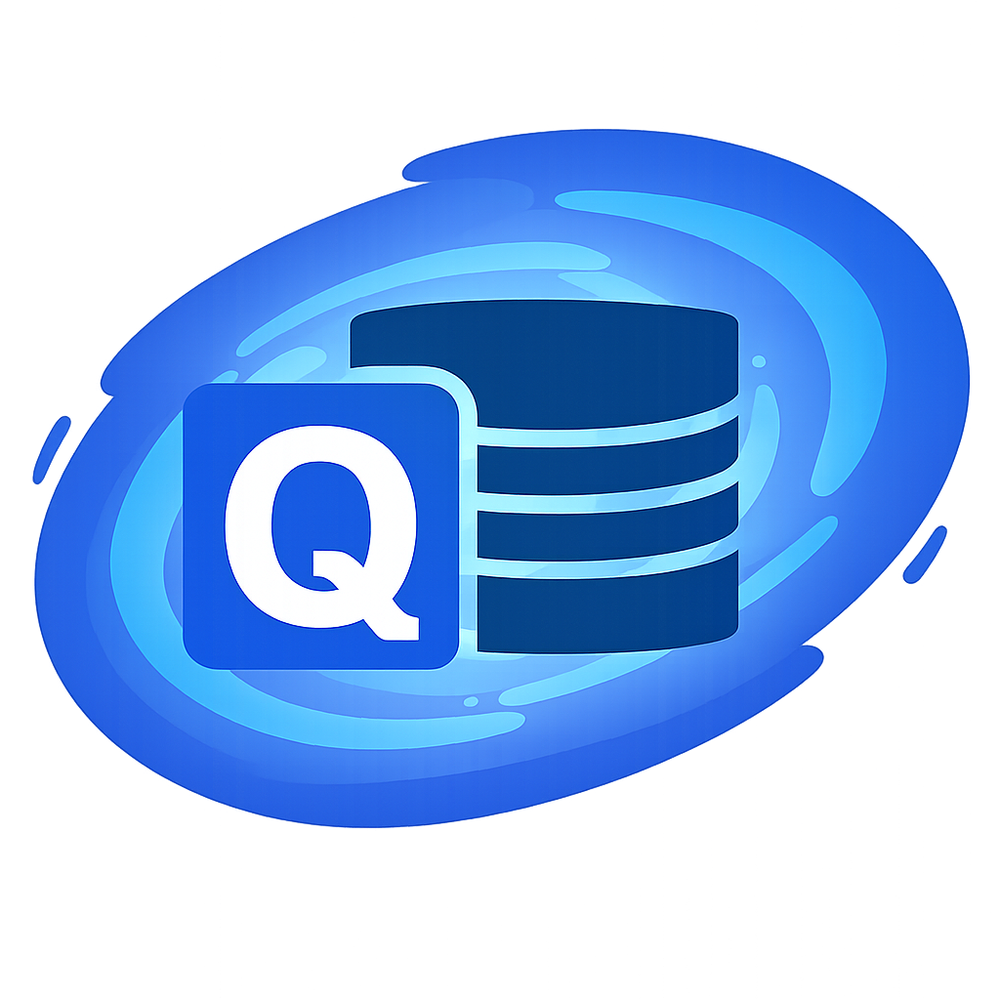

<h1 align="left">QueryVerse
  
</h1>

Perform SQL queries against [Microsoft Dataverse](https://learn.microsoft.com/en-us/power-apps/maker/data-platform/data-platform-intro) — ⚡blazingly⚡fast.

## What is QueryVerse?
QueryVerse is a [Dataverse](https://www.microsoft.com/en-us/power-platform/dataverse)-focused SQL client with fast query execution and a workflow tuned for everyday data access.

## Who is it For?
- **Developers:** iterate quickly with SQL-to-Fetch, paging, and TDS-aware performance.
- **Functional consultants:** validate data models, troubleshoot integrations, and share saved SQL with clients.
- **Business users:** run safe, repeatable queries and export results without a heavy setup.

## High-Level Objectives
- Drop-in replacement for a SQL client
  - Read and update
  - SQL-to-Fetch engine
  - Paging
  - JSON-to-entity conversion
  - TDS optimization
- Convert to FetchXML
- Save SQL files
- Save multiple connections
- Tabs
  - Each tab is a different connection
- Results window
  - Copy to JSON
  - Open JSON in a new window

## Acknowledgements
QueryVerse is lovingly inspired by the [SQL4CDS](https://www.xrmtoolbox.com/plugins/MarkMpn.SQL4CDS/) project. <3
